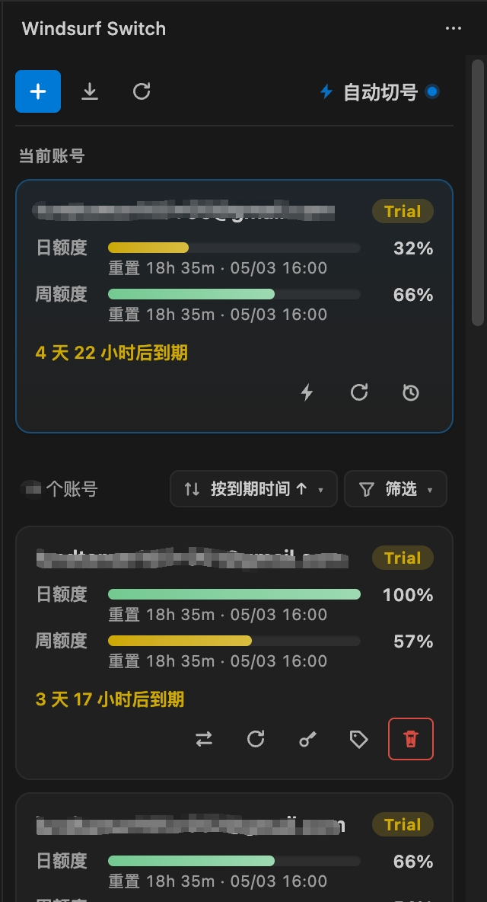

# Windsurf Switch · Windsurf Account Switcher

> A **multi-account switcher** dedicated for the Windsurf editor — No browser, no restart, one-click seamless account switching; cross-platform, cross-window sync, local encryption.


<p align="center">
  
</p>

---

## ✨ What It Does

| | |
|---|---|
| 🎯 **Seamless Switching** | No browser popup, no window restart, no interruption to Cascade chat or Terminal — ready to use immediately after switching |
| 🪟 **Cross-Window Sync** | Under multiple Windsurf windows, switching account in any window updates all other windows in real-time |
| 🤖 **Smart Switch** | Automatically select the best account by Plan / Quota / Cooldown; works with scheduled polling and log monitoring |
| 📦 **Shared Account Library** | Shares the same `accounts.json` with the desktop version `windsurf-manager-desktop`, editable bidirectionally |
| 🔄 **Batch Management** | Add · Delete · Batch Import (multiple formats) · One-click refresh all accounts' Plan / Quota / Expiry |
| 🛡️ **Local Encryption** | Windows uses DPAPI; macOS / Linux uses AES-256-GCM + local key; credentials never leave your device |
| 🎨 **Modern UI** | Card-based list · Progress bars change color based on remaining quota · Dropdown sort/filter · Icon buttons + tooltips |

---

## 🚀 Installation

### Method 1 — Download from Releases (Recommended)

1. Go to [Releases](https://github.com/haxi0/Windsurf-Tool/releases) and download the latest `windsurf-switch-X.X.X.vsix`
2. In Windsurf: `Cmd/Ctrl + Shift + P` → `Extensions: Install from VSIX...`
3. `Reload Window` (click when VSCode prompts)
4. The **Windsurf Switch** icon will appear in the left Activity Bar → Click to open the sidebar

### Method 2 — Build from Source

```bash
git clone https://github.com/haxi0/Windsurf-Tool.git
cd Windsurf-Tool
npm install              # Install typescript / @types/vscode / vsce
npm run package          # Compile src/ → out/, then package windsurf-switch-X.X.X.vsix
```

> The extension will **automatically patch Windsurf core** on first launch (to enable no-browser switching), no manual action needed.
> Windsurf upgrades will overwrite the core, the extension will automatically re-patch, but you need to fully quit with `Cmd+Q` and reopen.

---

## 🧩 Quick Start (5 Minutes)

| Step | Action |
|---|---|
| ① | Click the **➕ Add icon** at the top of the sidebar, enter email + password → Auto-login and encrypt to database |
| ② | Or click the **Batch Import icon**, paste `email:password` / `Account: x  Password: y` / JSON / CSV or any format (see popup instructions) |
| ③ | Click the ⇆ switch icon on the account card → **Silently switch to that account**, the "Current Account" area at the top of sidebar updates instantly |
| ④ | For automatic switching: Click **⚡ Auto Switch** on the right side of toolbar → Check "Account Refresh" (scheduled quota check) + "Trigger Threshold" [enter quota percentage], auto-switch when remaining quota falls below threshold |

---

## 📐 UI Overview

```
Sidebar ━━━━━━━━━━━━━━━━━━━━━━━━━━━━━━━━━━━━━━
  Windsurf Switch                         …        ← Title (… contains Logs / Open Data Dir / Reload)
━━━━━━━━━━━━━━━━━━━━━━━━━━━━━━━━━━━━━━━━━━━━━━
  [➕]  [⬇]  [↻]                  [⚡ Auto Switch ▾]   ← Toolbar (icons: Add · Batch Import · Refresh; Auto Switch dropdown on right)
━━━━━━━━━━━━━━━━━━━━━━━━━━━━━━━━━━━━━━━━━━━━━━
  Current Account

      user@x.com                          [Pro]    ← Current card (accent border)
      Daily ▰▰▰▰▰▱▱▱ 60%   · Reset 56m · 05/02 16:00
      Weekly ▰▰▰▰▰▰▰▱ 80%   · Reset 1d 0h · 05/03 16:00
      Expires in 5d 4h      [⚡ Smart][↻ Refresh][🕐 Reset Cooldown]

━━━━━━━━━━━━━━━━━━━━━━━━━━━━━━━━━━━━━━━━━━━━━━
  12 accounts         [↕ Expiry ↑ ▾]   [⏚ Filter ▾]   ← List header: Count + Sort + Filter
━━━━━━━━━━━━━━━━━━━━━━━━━━━━━━━━━━━━━━━━━━━━━━

      alice@x.com                       [Trial]
      Daily ▰▰▰▰▰▰▰▰ 100%
      Weekly ▰▰▰▰▰▰▱▱ 82%
      Expires in 7d 19h   [⇆ Switch][↻ Refresh][🔑 Copy][🏷 Remark][🗑 Delete]

      ...
```

**⚡ Auto Switch** (click the top-right toolbar button):

```
  ☑ Account Refresh        [2 minutes ▾]
  ☑ Trigger Threshold        [ 10 ] %           ← 0-99%, auto-switch when remaining quota falls below this value; turn off to only refresh without switching
  ☐ Monitor logs for instant switch
```

### Icon Reference

| Icon | Meaning |
|---|---|
| ⇆ | Switch to this account (list card) |
| ⚡ | Smart switch (current account card) |
| ↻ | Refresh this account's Plan / Quota |
| 🕐 | Reset smart switch cooldown (clear 15min skip records) |
| 🔑 | One-click copy `Account: x   Password: y` to clipboard |
| 🔧 | Supplement password and re-login (only appears when credentials missing) |
| 🏷 | Edit remark |

> Hover over any icon for ~120ms to see tooltip.

---

## Batch Import Supported Formats

Full instructions are in the popup, summary:

| Type | Example |
|---|---|
| Delimiter | `alice@x.com:Pass123` / `bob@x.com  Pwd` / `carol@x.io|MyP@ss` |
| Label format (single/multi-line, Chinese or English colons) | `Account: dave@x.com    Password: 88Dave88` |
| CSV / URL params | `email,password` or `email=x&password=y` |
| JSON array | `[{"email":"a","password":"p"}, ...]` |

> The format copied from the extension's built-in Copy button can also be pasted directly for import (the second type).

---

## Smart Switch

Click the **Auto Switch** button in the top-right of the toolbar, the popup panel has three options:

- **Account Refresh**: Every N minutes (30s / 1 / 2 / 5 / 10 min options) call Windsurf backend quota API to refresh current account quota snapshot
- **Trigger Threshold** (can be disabled): Enter **0-99** percentage (default 10), after account refresh if daily/weekly balance falls below this threshold, automatically switch to the best account in the candidate pool; turn off to only refresh data without switching
- **Monitor logs for instant switch (Experimental)**: Watch Windsurf process logs to match keywords like `quota exceeded` to trigger instant switching, without waiting for polling

The button shows a small accent dot when auto switch is enabled.

Candidate pool = Accounts passing current **filter** criteria + **not in 15min cooldown**.
Sort order determines priority (when sorted by expiry ascending, accounts nearing expiration are used first).

---

## 🔐 Data Storage / Privacy

| File | Purpose | macOS / Linux | Windows |
|---|---|---|---|
| `accounts.json` | Encrypted account list | `~/Library/Application Support/windsurf-manager-desktop/` | `%APPDATA%\windsurf-manager-desktop\` |
| VS Code SecretStorage | AES master key (mac/Linux) | System keychain / VS Code secret storage | — |
| `.cred.key` | Legacy AES master key fallback | Same as above (only read when SecretStorage unavailable or for old data migration) | — |
| `active.json` | Cross-window sync current account ID | Same as above | Same as above |

**Credentials are only stored on local disk, the extension will never upload any account information to any remote server.**

You can view / backup / migrate these files via the sidebar title bar `…` menu → **Open accounts.json Directory**.

---

## 🌐 Platform Compatibility

| | Windows | macOS | Linux |
|---|:---:|:---:|:---:|
| Encryption | DPAPI `ProtectedData` | AES-256-GCM | AES-256-GCM |
| Shared Account Library | ✅ | ✅ | ✅ |
| Seamless Switch Patch | ✅ | ✅ | ✅ |
| Cross-Window Sync | ✅ | ✅ | ✅ |

---

## 🛠️ Command Palette

`Cmd/Ctrl + Shift + P` type `Windsurf Switch` to see all commands:

- **Switch Account (QuickPick)** / **Switch with IdToken (Debug)**
- **Add Account** / **Batch Import** / **Batch Refresh** / **Reload Account List**
- **Open accounts.json Directory** / **Show Logs**
- **Smart Switch** / **Reset Smart Switch Cooldown**
- **Patch Windsurf** / **Restore Windsurf** / **Check Patch Status**
- **Diagnose Login Session (Debug)**

---

## ❓ FAQ

**Q: After switching, sidebar shows "Current account not detected"?**
A: Usually the Windsurf core patch hasn't taken effect yet. The patch is automatically written to disk when the extension activates, but Windsurf main process needs to fully quit with `Cmd+Q` and reopen to reload. If still having issues, run `Diagnose Login Session` and paste the Output.

**Q: Switching still opens browser?**
A: Windsurf upgrade overwrote the core `extension.js` and removed the patch. Reload Window to let the extension re-patch, then `Cmd+Q` restart Windsurf.

**Q: Is the desktop version `windsurf-manager-desktop` still needed?**
A: No. This extension can directly read/write `accounts.json`. The desktop version is a legacy GUI, keep it or not as you wish.

**Q: Current accounts don't sync across multiple VSCode windows?**
A: This extension uses `<accountsDir>/active.json` + `fs.watch` for real-time cross-window sync, millisecond-level. If it fails, please confirm both windows have this extension installed.

**Q: Progress bar color thresholds?**
A: Remaining > 60% green, 20%~60% yellow, ≤ 20% red.

---

## 🧱 Project Structure

```
windsurf-switch/
├── src/                      # TypeScript source
│   ├── extension.ts          # Command registration / cross-window sync / main flow
│   ├── sidebar.ts            # webview UI (CSS + HTML + frontend JS all here)
│   ├── windsurfApi.ts        # Firebase / Auth1 login + Quota API
│   ├── windsurfPatcher.ts    # Patch Windsurf core
│   ├── importParser.ts       # Batch import text parsing
│   ├── accountsStore.ts      # Encrypted account library read/write
│   └── ...
├── out/                      # Compiled output (npm run compile output, bundled into vsix by vsce package)
├── resources/
│   └── icon.svg              # Activity Bar icon
├── tsconfig.json             # Permissive mode (noImplicitAny: false) for incremental typing
├── .vscodeignore             # Exclude src / map / backups when packaging vsix
├── package.json              # Extension manifest
├── LICENSE
└── README.md
```

Build:

```bash
npm install
npm run compile     # Compile once
npm run watch       # Continuous compile
npm run package     # Compile + package vsix
```

---

## 🤝 Contributing

Issues / PRs welcome:

- When reporting bugs, please attach Output content from `…` → **Show Logs**
- When changing UI, please upload before/after screenshots
- When changing parser, please add test cases

---

## � Releasing (Maintainers)

Releases are produced automatically by the GitHub Actions workflow `.github/workflows/release.yml` whenever a tag matching `v*` is pushed.

```bash
# bump patch version, commit, tag and push (triggers the release workflow)
npm run release

# or bump a specific level / explicit version
npm version minor -m "chore(release): v%s" && git push --follow-tags
npm version 1.3.0 -m "chore(release): v%s" && git push --follow-tags
```

The workflow will:

1. Verify `package.json` version matches the tag.
2. Run `npm ci` + `npm run compile`.
3. Build `windsurf-switch-<version>.vsix` with `@vscode/vsce`.
4. Generate changelog from git history since the previous tag.
5. Publish a GitHub Release with the VSIX attached.

You can also dispatch it manually from the **Actions → Release** tab.

---

## �📋 Known Limitations

- Windsurf upgrades overwrite core, requiring auto re-patch + `Cmd+Q` restart
- Extension only recognizes Firebase / Auth1 login paths (covers 99% of scenarios)
- Some account Plan info may take 1~2 seconds to refresh after switching

---

## 🙏 Acknowledgments

Inspiration and early implementation ideas from the [`aliu.windsurf-pro`](https://github.com/) project. This repository rebuilt the sidebar UI, batch import, smart switch, cross-window sync and other modules based on it, and was renamed to **Windsurf Switch**.

---

## 📜 License

[MIT](LICENSE) © 2026 illfen
